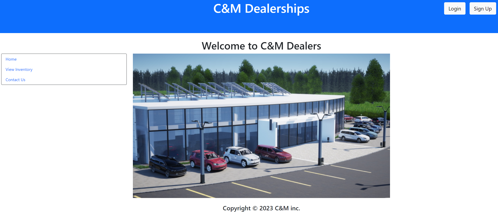

# legendary-fiesta-Project-03
Team 1 Project 03

## Description

Our project is an online car dealership platform that allows the user to browse the inventory for C&M Dealers.  Users can create an account, browse the available vehicles, create appointments for test drives, and update or delete those appointments.  There are five vehicle categories to choose from.  There are coupes, sedans, SUVs, hatchbacks, and trucks.  Each vehicle has associated data such as its price, condition, mileage, and color.  Users can find the car of their dreams and schedule a test drive.

## Table of Contents

- [Installation](#installation)
- [Usage](#usage)
- [Credits](#credits)

## Installation

The application is deployed through Heroku.  To run the application locally, you will need node.js installed.  You will also need to run npm install to install the dependencies

## Usage

After arriving on the homepage, you can use the nav area to view the inventory by selecting a vehicle type to view.  You will then be presented with all of the vehicles associated with the chosen type.  If you select one of the vehicles from the list, you will see a dedicated page for that vehicle with the available information for that vehicle.  If you are logged in, you will be able to create an appointment for a test drive for the chosen vehicle.  You can also update or delete your appointments by selecting view appointments in the nav and modifying the desired appointment.  Contact information for the dealership is available by selecting the contact us page in the nav.

Dealership Application Screenshot:

Link to Deployed Application in Heroku: https://radiant-fortress-44546-0acbf05b7546.herokuapp.com/

## Credits

Craig von Bartheld
https://github.com/Craigien

Mitchell Lea
https://github.com/leamr10